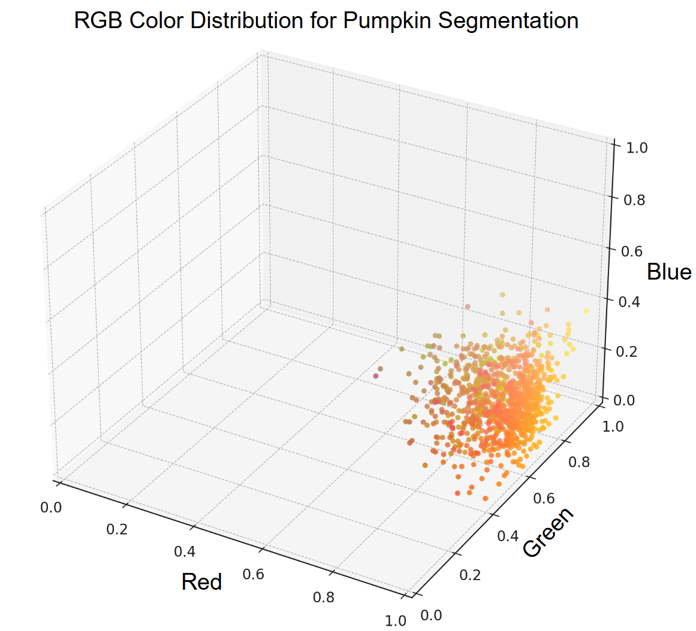

Background
============================================

.. _cdc-color-distribution:

Color Distribution
---------------------------------------------------

A **color distribution** refers to how different color values are spread or represented within a specific color space.
In an RGB image, the color distribution consists of a continuous region within a **three-dimensional space** defined by the **red**, **green**, and **blue** channels.

In digital images, each pixel’s color is determined by a combination of red, green, and blue values, typically ranging from 0 to 255.
Therefore, the RGB color space can be represented as a 3D domain: :math:`[0, 255]^3`.

The **SDU Agro Tools** plugin begins by defining a color distribution based on a set of pixel values selected from the input raster layer.
This selection can be made using either a :ref:`shape file <calculate-color-distribution-shape>` or a :ref:`reference image <calculate-color-distribution-image>`.

The RGB values of the selected pixels form a color distribution that can be statistically characterized using the **mean** and **standard deviation** for each channel.
These statistical measures represent the central tendency and the variability of the selected pixel values in the RGB space.

Once a color distribution has been defined, the plugin computes the **color distance** between every pixel in the raster layer and the defined distribution.
This allows the identification of pixels belonging to the target element to be segmented (e.g., pumpkins), based solely on the RGB values of a representative subset of pixels.

.. _cdc-mahalanobis-distance:

Mahalanobis distance
---------------------------------------------------

The **Mahalanobis distance** is the default method used in this plugin to compute the **color distance** between a pixel and a reference color distribution.
Unlike the Euclidean distance, the Mahalanobis distance takes into account the **correlations between variables** and the **scale of the data**, making it well-suited for multivariate comparisons.

In the context of color analysis, the Mahalanobis distance measures how far a color (e.g., an RGB pixel value) is from the **mean color** of a distribution, while considering the **covariance** between color channels.
This allows the plugin to determine how typical or atypical a pixel color is with respect to a reference color model — a greater distance indicates that the pixel is more likely to be out of distribution.

Mathematically, the Mahalanobis distance is defined as:

:math:`D_M(x) = \sqrt{(x - \mu)^T \Sigma^{-1} (x - \mu)}`

where:

- :math:`x` is the input color vector (e.g., RGB)

- :math:`\mu` is the mean color vector of the distribution

- :math:`\Sigma` is the covariance matrix of the distribution

This formulation enables the plugin to identify whether a given pixel belongs to the target color distribution, which is essential for color-based segmentation tasks.

For a more detailed theoretical explanation, refer to the `Mahalanobis distance article on Wikipedia <https://en.wikipedia.org/wiki/Mahalanobis_distance>`_.

To explore the specific implementation used in this plugin, consult the `CDC documentation <https://henrikmidtiby.github.io/CDC/notes/calculate_dist.html#calculating-distance-to-the-color-model-using-mahalanobis>`_.

.. _cdc-gmm-distance:

GMM distance
---------------------------------------------------

A **Gaussian Mixture Model** (GMM) is a probabilistic model that represents a dataset as a combination (mixture) of multiple Gaussian (normal) distributions.
Each component models a subgroup of the data, allowing the overall model to capture complex, multimodal distributions.

In this plugin, GMMs are used to model the color distribution of reference pixels. This approach provides a better fit than using a single normal distribution, especially when the pixel values are diverse.

To estimate how close a given point (e.g., a pixel's color) is to the color distribution modeled by a GMM, we use the following expression:

:math:`\sqrt{\max(0, L_{\text{max}} - L)}`

where:

- :math:`L` is the log-likelihood of the point under the GMM. This gives a score indicating how well the point fits the learned distribution.
- :math:`L_{\text{max}}` is the maximum log-likelihood among all annotated (reference) pixels.

:math:`L_{\text{max}}` serves as an approximation of the global maximum likelihood.
The subtraction ensures that pixels close to the reference distribution yield distances near zero.
The :math:`\max(0, \cdot)` operation avoids negative values under the square root.

For more theoretical background, refer to the `Gaussian Mixture Model article on Wikipedia <https://en.wikipedia.org/wiki/Mixture_model>`_.

To learn how to fit a GMM to a set of pixel values in Python, consult the `scikit-learn documentation <https://scikit-learn.org/stable/modules/generated/sklearn.mixture.GaussianMixture.html>`_.
