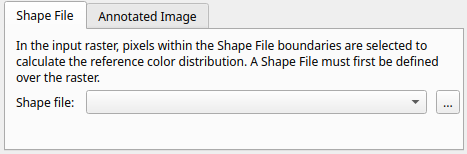
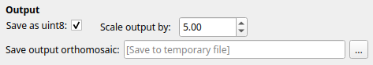
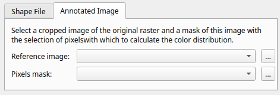
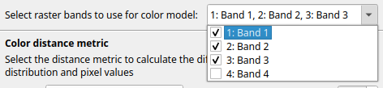
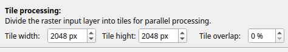

CDC Reference
=============

.. _cdc-load-files:

Load Input Files
----------------

To use the plugin, you must provide two input elements:

* **Orthomosaic to process**: Input raster layer ``.tif`` that contains the image data on which the plugin will operate.

* **Color distribution reference**: Input file(s) used to define the :ref:`cdc-color-distribution`, either:

 - :ref:`Vector layer <calculate-color-distribution-shape>`: Define pixel region directly on the orthomosaic. File format ``.shp``
 - :ref:`Reference images <calculate-color-distribution-image>`: Two cropped images from the orthomosaic - one is the original, and the other contains pixel masks as annotations. File format ``.tiff`` and ``.tiff`` or ``.jpg``.

To choose between these reference types, select the corresponding tag in the plugin menu.

Load Files
~~~~~~~~~~

For each input, you can either:

.. |three-dot-icon| raw:: html

    

.. |drop-down-icon| raw:: html

    

* Use the **drop-down menu** |drop-down-icon| to chose compatible files from the current QGIS project.
* Click the |three-dot-icon| button to browse local files.

**Heads-up:**  If no files appear in the drop-down menu:

1. **Check that layers are loaded in the current project**
   The drop-down menu only displays layers from the currently open project.
   If you're unsure how to add layers, check the official QGIS tutorial `Loading Data into the Map <https://docs.qgis.org/3.40/en/docs/training_manual/complete_analysis/analysis_exercise.html?utm_source=chatgpt.com#loading-data-into-the-map>`_.

2. **Ensure the files are in the correct format**
   The plugin automatically filters out unsupported files. Only files with the following formats will appear:

   - Input raster layer ``.tif``.
   - Reference Image ``.tif``.
   - Pixel mask ``.tif`` or ``.jpg`` / ``.jpeg``.
   - Shape File ``.shp``

3. **Reopen the plugin menu**
   The drop-down menu scans for available files when the plugin is first opened.
   If you loaded new files after opening the plugin, close and reopen the plugin to refresh the list.

.. _cdc-output-file:

Save Output File
----------------

Click the |three-dot-icon| button next to the :guilabel:`Output segmented orthomosaic` label to open a file browser. Select the destination folder and filename; the chosen path will appear in the adjacent text box.

Saving options
~~~~~~~~~~~~~~

The plugin generates an output raster ``.tif`` with the results. If no output file is chosen the output will be saved in a tempoary file that is discarded when QGIS is closed. Use the :guilabel:`Save as uint8` checkbox to choose the pixel data type:

- **uint8** (default): 8-bit per pixel, producing a lighter file.
- **float64**: 64-bit per pixel, providing full numerical precision. Useful if input orthomosaic contains hyper spectral data and output is desired to have same format.

When :guilabel:`Save as uint8` is checked, the :guilabel:`Scale output by` activates.  This value (default 5) scales the output before converting it to 8-bit within the range [0, 255]. Higher values expand the range to increase detail and better utilize the [0, 255] interval, while lower values reduce detail and help prevent saturation.

Reference color pixel Calculation
---------------------------------

The plugin operates by calculating the distance from each pixel in the input raster layer (orthomosaic) to a :ref:`cdc-color-distribution`.

There are two methods to define the color reference:

- **Shape File** (recommended)
- **Reference Image**

.. _calculate-color-distribution-shape:

Calculate Color Distance from Shape File
~~~~~~~~~~~~~~~~~~~~~~~~~~~~~~~~~~~~~~~~

You can define the :ref:`cdc-color-distribution` using a ShapeFile by selecting the :guilabel:`Shape File` tab in the :guilabel:`Color Distribution Reference` section:

This is the most straightforward method for generating a color reference.
If you need to create a shapefile, refer to: :ref:`cdc-dataset-from-vector-layer`.

The **Shape File** should be a QGIS vector layer containing a polygon.
All pixels from the input raster layer that fall within this polygon will be used to compute the color distribution.

.. figure:: ../_static/tutorial/cdc/ShapeFile.png

If you're unsure how to load the shapefile, see: :ref:`cdc-load-files`.
The :guilabel:`Shape File` dropdown menu |drop-down-icon| will display only files with the ``.shp`` extension.

.. _calculate-color-distribution-image:

Calculate Color Distance from Images
~~~~~~~~~~~~~~~~~~~~~~~~~~~~~~~~~~~~

You can define the :ref:`cdc-color-distribution` using image input by selecting the :guilabel:`Image` tab in the **Color Distribution Reference** section:

This method requires two perfectly aligned images:

- **Reference Image**: A cropped section of the orthomosaic.
- **Pixel Mask**: A corresponding crop, where selected pixels are highlighted in **red**.

If you need to create these files, refer to: :ref:`cdc-dataset-from-reference-image`.
If you're unsure how to load the images, consult: :ref:`cdc-load-files`.

The color distribution is calculated based on the **Reference Image**, using only the pixels marked in red in the **Pixel Mask**. Therefore, both images must be precisely aligned — sharing identical dimensions and pixel positions — as illustrated below:

.. raw:: html

    

        

            

                
                
<code>Reference Image</code>

            

        

        

            

                
                
<code>Pixel Mask</code>

            

        

    

The **Reference Image** only accept ``.tif`` files and **Pixel Mask** will accept ``.tif`` and ``.jpg`` / ``.jpeg``.

.. warning:: When selecting reference image and pixel mask:

    - Do not mistakenly select the main input raster ``.tif`` as the Reference Image. This will result in an error.
    - Ensure that the **Reference Image** and **Pixel Mask** are correctly selected. If the same file is selected for both, the plugin will generate an error message.

Color Distance Calculation
--------------------------
This plugin computes the distance from each pixel in the input raster layer (orthomosaic) to a predefined :ref:`cdc-color-distribution`. Two distance metrics are available:

- **Mahalanobis**
- **Gaussian Mixture Model (GMM)**

.. _calculate-distance-mahalanobis:

Color Distance Using Mahalanobis
~~~~~~~~~~~~~~~~~~~~~~~~~~~~~~~~

The **Mahalanobis distance** uses the statistics of the :ref:`cdc-color-distribution` to measure how far each pixel is from the distribution's mean, normalized by the distribution’s covariance matrix. If you want to explore underlying principles, see :ref:`cdc-mahalanobis-distance`.

Mahalanobis is the **default metric** used by the plugin as it is the most direct and computationally efficient way to compute color distance. To apply it, ensure that :guilabel:`Mahalanobis` is selected in the :guilabel:`Metric` dropdown menu |drop-down-icon| within the :guilabel:`Color Distance Metric` section.

It is possible to restrict the computation to specific color bands by modifying the checkboxes in the :guilabel:`Band to Use` setting. In this case, the Mahalanobis distance will be computed using only the selected channels. To learn how to adjust these settings, refer to :ref:`cdc-bands-to-use`.

.. _calculate-distance-gmm:

Color Distance Using Gaussian Mixture Model
~~~~~~~~~~~~~~~~~~~~~~~~~~~~~~~~~~~~~~~~~~~

The :ref:`cdc-color-distribution` can be approximated using a **Gaussian Mixture Model (GMM)** composed of ``K`` Gaussian components. Each component has its own mean, covariance matrix, and weight. This method provides a more flexible representation of color distributions than a single Gaussian model.

To understand how GMM works and how pixel distances are calculated, refer to the :ref:`cdc-gmm-distance`.

To use the GMM metric, select :guilabel:`Gaussian Mixture Model` from the :guilabel:`Metric` dropdown menu |drop-down-icon| within the :guilabel:`Color Distance Metric` section.

Selecting this metric will enable the option :guilabel:`Number of Components`, which allows you to specify the number of Gaussian components to use (default is 2). Increasing the number of components may improve the approximation of complex color distributions, but it will also increase computation time.

.. warning::

    Using the :guilabel:`Gaussian Mixture Model` metric significantly increases computation time.
    The same applies when increasing the number of components.

GMM is a more computationally demanding metric than :ref:`calculate-distance-mahalanobis`. It is best suited for complex or multi-modal color distributions. We recommend starting with the Mahalanobis method. If the results are not satisfactory, then try the GMM option.

You can restrict the computation to specific color bands by modifying the checkboxes in the :guilabel:`Band to Use` setting. In this case, the GMM distance will be calculated using only the selected bands. To learn how to adjust these settings, see: :ref:`cdc-bands-to-use`.

.. _cdc-bands-to-use:

Color Bands
~~~~~~~~~~~

It is possible to perform color distance calculations based **only on specific color bands**. Bands that are not selected are excluded from the statistical distribution, meaning that their information does not influence the final result in any way.

In the :guilabel:`Select raster bands to use for color model` section, the **drowndown** with **checkboxes** for the different bands where all bands except the last (assumed to be alpha) are selected by default, as shown in the image below.
Unchecking a band excludes it from the calculation.

This feature allows you to tailor the color distance computation to your specific application especially useful if the input orthomosaic contains hyper spectral data where only certain channels are desired.

.. _cdc-tile-processing:

Tiles Processing
----------------

The plugin improves performance by dividing the input raster layer into **multiple tiles**, which are processed in parallel using multithreading. This means that the color distance calculation is distributed across several **threads**, with each thread handling a different tile of the image at the same time. This parallel execution significantly reduces processing time, especially for large orthomosaics.

For in-depth information on multithreaded execution, refer to the :ref:`notes-concurrent-futures`.

You can configure the **tile size** to control how the raster is split.

.. _cdc-tile-size:

Tile Dimensions
~~~~~~~~~~~~~~~

You can customize the **width** and **height** of the tiles into which the input raster layer is divided. These dimensions determine how the raster is split and directly impact the **number of tiles** generated, which in turn can affect the **total computation time**.

.. |arrows-icon| raw:: html

    

To adjust the tile size, use the |arrows-icon| in the :guilabel:`Tiles width` and :guilabel:`Tiles height` fields, or enter the desired values manually in the corresponding text boxes.
The default tile size is **2048 × 2048 pixels**.

Start and Cancel Processing
---------------------------

.. |ok-icon| raw:: html

    

.. |cancel-icon| raw:: html

    

Once you have configured all plugin parameters, start the process by clicking the |ok-icon| button. If there is an issue with the input configuration, an error message will appear. Refer to the relevant sections of this documentation to resolve the specific error described. If everything is correct, the plugin will begin execution. A progress bar like the one shown below will indicate the current status of the operation:

.. figure:: ../_static/tutorial/cdc/progressbar.png
   :align: center

You can **cancel the operation at any time** during processing by clicking the |cancel-icon| button in the progress bar window. The plugin will take a moment to stop execution and attempt to clean up intermediate data.
