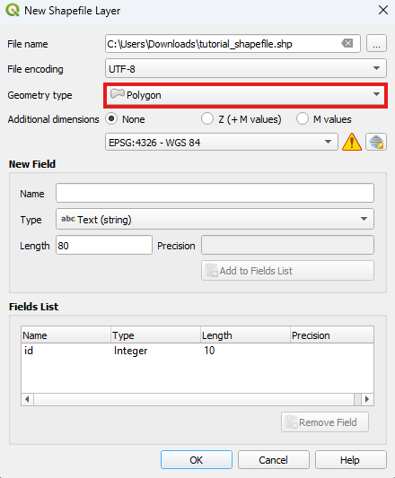
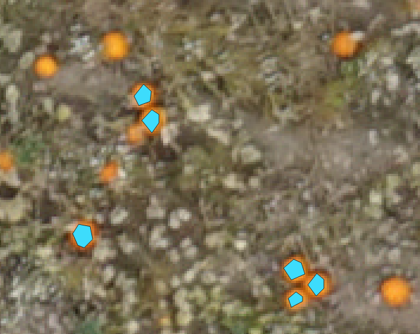
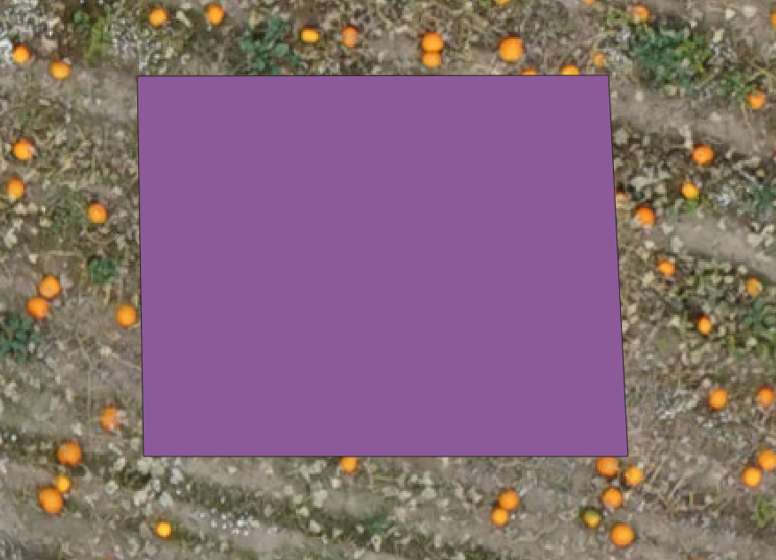
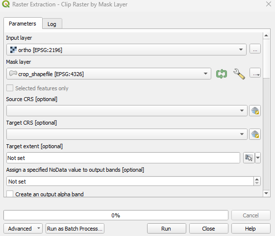
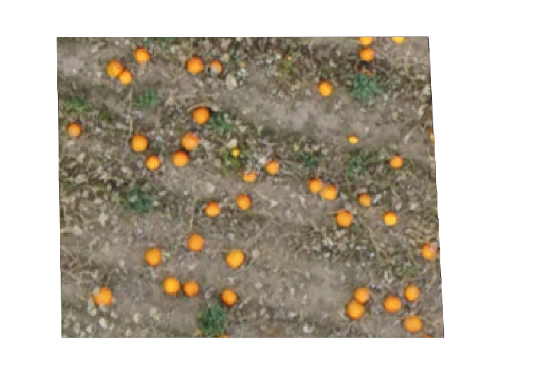
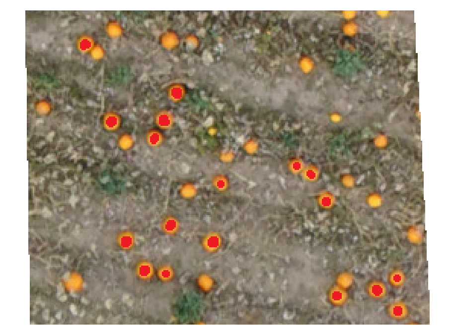

Create dataset guide
====================

*QGIS AgrooTool Color Segmenter* needs a source of data to calculate the :ref:`Color Distribution <color_distribution>`, whether:

- **Shape File**: Define a region on the input orthomosaic which contain the pixel to be used as reference.

- **Reference image** and **Pixel Mask**: A section of the input orthomsaic where the reference pixels are annoted. This options requires two files.

In this guide we will show how to define a shape file or extract a section of a orthomosaic and how to annotate the section.

This guide assumes we have an orthomosaic with the name ``ortho.tif``. We will work on the pumpkins segmentation example from the :ref:`Tutorial <tutorial>`.

.. _shapefile:

Shape File
----------------
In this section, we explain how to create a **QGIS Shape File** created with polygon type. with polygon geometry. This is a vector file format that stores the geometries of closed areas (polygons). The pixel from ``ortho.tif`` within the shapefile are used to calculate the :ref:`Color Distribution <color_distribution>` used for the distance calculation.

1. **Open your QGIS project** with the input raster file ``ortho.tif``.

.. |shapefile-icon| raw:: html

   

2. **Create a new shapefile layer** by navigating to the menu entry ``Layer ► Create Layer ► New Shapefile Layer`` or clicking the icon |shapefile-icon| on the top toolbar. This will open the :guilabel:`New Shapefile Layer` dialog, where you can define the properties of your new layer.

3. Click :guilabel:`...` for the :guilabel:`File Name` field to open a file browser. Choose a recognizable name and save the file. For this tutorial, we will use ``shapefile.shp``.

4. Under :guilabel:`Geometry Type`, select **Polygon**. You should see something similar to the following:

5. Click :guilabel:`OK`. The new shapefile will now appear in your project. Initially this layer is empty, we have to define the region of interset on the ``ortho.tif``.

.. |toggle-icon| raw:: html

   

6. In the :guilabel:`Layer` panel, select ``shapefile``. Then, click the |toggle-icon| :sup:`Toggle Editing` button in the top toolbar, or right-click the shapefile and choose |toggle-icon| :guilabel:`Toggle Editing` from the context menu.

.. |polygon-icon| raw:: html

   

7. Once you enter edit mode, the digitizing tools become active. Click the |polygon-icon|:sup:`Capture Polygon` button to start drawing a polygon.

8. With ``ortho.tif`` layer visible, left-click to place points around the area you want to outline. We recommend drawing several polygons with the color you want to use as a reference. For example, in the pumpkin segmentation use case, we selected multiple pumpkins, as shown in the figure below. After finishing each polygon, the :guilabel:`Attributes` dialog will appear asking you to set an ID for the polygon. This is not required by the plugin, so you can leave it blank.

9. Remeber to unselect the |toggle-icon| :sup:`Toggle Editing` to save the changes. You have now created the required shapefile to use as a reference for color selection!

If you encounter any issues or would like more detailed instructions, please consult the official QGIS documentation: `Creating a New Vector Dataset <https://docs.qgis.org/3.40/en/docs/training_manual/create_vector_data/create_new_vector.html#lesson-creating-a-new-vector-dataset>`_.

We now have all we need to :ref:`Calculate Color Distance from Shape File <calculate-color-distribution-shape>`:

- The orthomosaic ``ortho.tif``.
- ShapeFile ``shape_file.shp``.

.. _ref_image:

Image
---------------------

It is possible to define a color reference directly from an image. In this section, we explain how to create a :guilabel:`Reference Image` as a **cropped orthomosaic**, along with a corresponding :guilabel:`Pixel Mask`.

The :guilabel:`Pixel Mask` determines which pixels from the :guilabel:`Reference Image` will be used to compute the :ref:`Color Distribution <color_distribution>`. These two files must be perfectly aligned, meaning they must have identical dimensions and pixel arrangements.

Crop orthomosaic
~~~~~~~~~~~~~~~~~~~~~~

To extract a specific area from the orthomosaic, we will use the `GDAL <https://gdal.org/en/stable/index.html>`_ tools integrated into the QGIS framework.

1. **Open your QGIS project** containing the input raster file ``ortho.tif``.

2. **Create a shapefile that defines the cropping area.**
   If you're not familiar with this process, refer to the guide :ref:`Create a ShapeFile <shape_file>`.
   In this case, instead of creating multiple polygons to select specific colors, you should draw a single, large polygon to define the area to crop — as shown in the example below.
   In this tutorial, we will name the shapefile ``crop_shapefile.shp``.

3. Navigate to ``Raster ► Extraction ► Clip Raster by Mask Layer...``.
   This will open the :guilabel:`Raster Extraction` dialog.
   Select the input orthomosaic ``ortho.tif`` and the shapefile ``crop_shapefile.shp`` as the :guilabel:`Mask Layer`.
   You should see a screen similar to the one below:

.. |three-dot-icon| raw:: html

    

4. Scroll down to the :guilabel:`Clipped (mask)` section, click the |three-dot-icon| button, and select ``Save to File...``.
   Choose a location and filename for the reference image — in this tutorial, we’ll save it as ``ref_image.tif``.
   You may also save the reference image as a ``.jpg`` or ``.jpeg``; these are the only three formats supported by the plugin.
   Click :guilabel:`Run`. The reference image will be added to your current project. The result should look similar to this:

Regarding the color format of the reference image:
 - If saved as a ``.tif`` file, it will retain the original color bands from the input orthomosaic ``ortho.tif``, typically in **RGBA** format.
 - If saved as a ``.jpg`` or ``.jpeg``, the alpha channel (**A**) will be discarded, resulting in an **RGB** image.

If the source raster layer is not in RGBA format, the cropping process will still apply successfully, and the reference image will preserve the same color characteristics as the original layer.

Mask Annotation
~~~~~~~~~~~~~~~~~~~~~~

Now we proceed to mark over the reference image the desired pixeles to use for the :ref:`Reference Color Distribution <color_distribution>`.

To annotate the mask we will use `GIMP <https://www.gimp.org/>`_, but another image manipulations software can also be used.

1. Open the ``ref_image.tif`` we created earlier in GIMP.

2. Set the color to red. E.g. RGB (255, 0, 0).

3. Select the pencil tool and adjust size to preference.

4. Paint on top of the desired pixels to include in the reference color. Not all pixels of the desired color have to be painted over but at least 100 pixels is necessary, but more is better.

5. Export the image ``File ► Export as``. We save the annoted mas as ``mask.tiff``.

We now have all we need to :ref:`Calculate Color Distance from Images <calculate-color-distribution-image>`:

- The orthomosaic ``ortho.tif``.
- Reference image ``ref_image.tif``.
- Annotated image ``mask.png``.
