.. _how-to:

How-to Guide
============================================

.. _load_files:

Load Input Files
---------------------------------------------------

To use the plugin, you must provide two input elements:

* **Orthomosaic to process**: Input raster layer ``.tif`` that contains the image data where the plugin will operate.

* **Color distribution reference**: Input file(s) used to define the :ref:`color distribution <color_distribution>`, either:

 - :ref:`Shape file <calculate-color-distribution-shape>`: Define pixel region directly on the orthomosaic. File format ``.shp``
 - :ref:`Reference images <calculate-color-distribution-image>`: Two cropped images from the orthomosaic - one is the original, and the other contains pixel masks as annotations. File format ``.tiff`` or ``.jpg`` / ``.jpeg``.

To choose between these reference types, select the corresponding tag in the plugin menu.

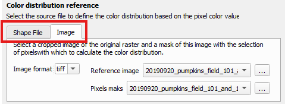

How to Load Files
~~~~~~~~~~~~~~~~~~~~~~

For each input, you can either:

.. |three-dot-icon| raw:: html

    

.. |drop-down-icon| raw:: html

    

* Use the **drop-down menu** |drop-down-icon| to chose compatible files from the current QGIS project.
* Click the |three-dot-icon| button to browse local files.

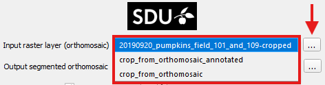

**Heads-up:**  If no files appear in the drop-down menu:

1. **Check that layers are loaded in the current project**
   The drop-down menu only displays layers from the currently open project.
   If you're unsure how to add layers, check the official QGIS tutorial `Loading Data into the Map <https://docs.qgis.org/3.40/en/docs/training_manual/complete_analysis/analysis_exercise.html?utm_source=chatgpt.com#loading-data-into-the-map>`_.

2. **Ensure the files are in the correct format**
   The plugin automatically filters out unsupported files. Only files with the following formats will appear:

   - Input raster layer ``.tif``.
   - Reference Image & Pixel mask ``.tif`` or ``.jpg`` / ``.jpeg``.
   - Shape File ``.shp``

3. **Reopen the plugin menu**
   The drop-down menu scans for available files when the plugin is first opened.
   If you loaded new files after opening the plugin, close and reopen the plugin to refresh the list.

.. _output_file:

Save Output File
---------------------------------------------------

Click the |three-dot-icon| button next to the :guilabel:`Output segmented orthomosaic` label to open a file browser. Select the destination folder and filename; the chosen path will appear in the adjacent text box.

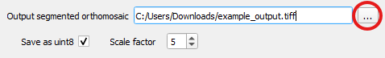

Saving options
~~~~~~~~~~~~~~~~~~~~~~

The plugin generates an output raster ``.tif`` with the results. Use the :guilabel:`Save as uint8` checkbox to choose the pixel data type:

- **uint8** (default): 8-bit per pixel, producing a lighter file.
- **float64**: 64-bit per pixel, providing full numerical precision but significantly increasing computation time.

.. warning::

    Uncheck  :guilabel:`Save as uint8` will considerably slow down processing.

Select float64 only when high numerical precision per pixel is required  (15–17 significant decimal digits). Otherwise, uint8 is recommended, as it provides comparable results with reduced consumption resource.

When :guilabel:`Save as uint8` is checked, the :guilabel:`Scale factor selector` activates.  This value (default 5) scales the output before converting it to 8-bit within the range [0, 255]. Higher values expand the range to increase detail and better utilize the [0, 255] interval, while lower values reduce detail and help prevent saturation.

Reference color pixel Calculation
---------------------------------------------------
The plugin operates by calculating the distance from each pixel in the input raster layer (orthomosaic) to a :ref:`reference color distribution <color_distribution>`.
There are two methods to define the color reference:

- **Shape File** (recommended)
- **Reference Image**

.. _calculate-color-distribution-shape:

Calculate Color Distance from Shape File
~~~~~~~~~~~~~~~~~~~~~~~~~~~~~~~~~~~~~~~~~~~~~~~~~~~~~~~~~~~~~~~~~~
You can define the :ref:`Color Distribution <color_distribution>` using a ShapeFile by selecting the :guilabel:`Shape File` tab in the :guilabel:`Color Distribution Reference` section:

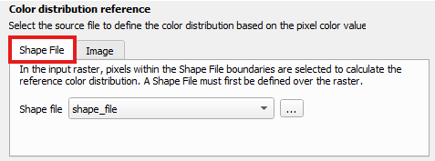

This is the most straightforward method for generating a color reference.
If you need to create a shapefile, refer to: :ref:`How to Create Shape File <shapefile>`.

The **Shape File** should be a QGIS vector layer containing a polygon.
All pixels from the input raster layer that fall within this polygon will be used to compute the color distribution.

.. figure:: _static/how_to/ShapeFile.png

If you're unsure how to load the shapefile, see: :ref:`Load Input Image <load_files>`.
The :guilabel:`Shape File` dropdown menu |drop-down-icon| will display only files with the ``.shp`` extension.

.. _calculate-color-distribution-image:

Calculate Color Distance from Images
~~~~~~~~~~~~~~~~~~~~~~~~~~~~~~~~~~~~~~~~~~~~~~~~~~~~~~~~~~~~~~~~~~

You can define the :ref:`Color Distribution <color_distribution>` using image input by selecting the :guilabel:`Image` tab in the **Color Distribution Reference** section:

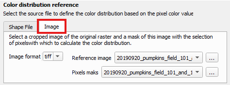

This method requires two perfectly aligned images:

- **Reference Image**: A cropped section of the orthomosaic.
- **Pixel Mask**: A corresponding crop, where selected pixels are highlighted in **red**.

If you need to create these files, refer to: :ref:`How to Create Reference Images <ref_image>`.
If you're unsure how to load the images, consult: :ref:`Load Input Image <load_files>`.

The color distribution is calculated based on the **Reference Image**, using only the pixels marked in red in the **Pixel Mask**. Therefore, both images must be precisely aligned — sharing identical dimensions and pixel positions — as illustrated below:

.. raw:: html

    

        

            

                
                
<code>Reference Image</code>

            

        

        

            

                
                
<code>Pixel Mask</code>

            

        

    

The :guilabel:`Image Format` dropdown allows you to choose between ``.tif`` and ``.jpg``/``.jpeg`` formats.
The **Reference Image** and **Pixel Mask** selection menus |drop-down-icon| will display only files matching the chosen format.

.. warning:: When using ``.tif`` files:

    - Do not mistakenly select the main input raster ``.tif`` as the Reference Image. This will result in an error.
    - Ensure that the **Reference Image** and **Pixel Mask** are correctly selected. If the same file is selected for both, the plugin will generate an error message.

Color Distance Calculation
---------------------------------
This plugin computes the distance from each pixel in the input raster layer (orthomosaic) to a predefined :ref:`Color Distribution <color_distribution>`.
Two distance metrics are available:

- **Mahalanobis**
- **Gaussian Mixture Model (GMM)**

.. _calculate-distance-mahalanobis:

Color Distance Using Mahalanobis
~~~~~~~~~~~~~~~~~~~~~~~~~~~~~~~~~~~~~~~~~~~~

The **Mahalanobis distance** uses the statistics of the :ref:`Color Distribution <color_distribution>` to measure how far each pixel is from the distribution's mean, normalized by the distribution’s covariance matrix.
If you want to explore underlying principles, see the :ref:`background section on Mahalanobis distance <mahalanobis_distance>`.

Mahalanobis is the **default metric** used by the plugin as it is the most direct and computationally efficient way to compute color distance.
To apply it, ensure that :guilabel:`Mahalanobis` is selected in the :guilabel:`Metric` dropdown menu |drop-down-icon| within the :guilabel:`Color Distance Metric` section:

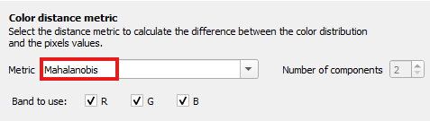

It is possible to restrict the computation to specific color bands by modifying the checkboxes in the :guilabel:`Band to Use` setting.
In this case, the Mahalanobis distance will be computed using only the selected channels. To learn how to adjust these settings, refer to :ref:`Select Color Bands <bands_to_use>`.

.. _calculate-distance-gmm:

Color Distance Using Gaussian Mixture Model
~~~~~~~~~~~~~~~~~~~~~~~~~~~~~~~~~~~~~~~~~~~~~~~~~~~~~~~~~~~~~~~~~~

The :ref:`Reference Color Distribution <color_distribution>` can be approximated using a **Gaussian Mixture Model (GMM)** composed of ``K`` Gaussian components.
Each component has its own mean, covariance matrix, and weight.
This method provides a more flexible representation of color distributions than a single Gaussian model.

To understand how GMM works and how pixel distances are calculated, refer to the :ref:`background section on Gaussian Mixture Model distance <gmm_distance>`.

To use the GMM metric, select :guilabel:`Gaussian Mixture Model` from the :guilabel:`Metric` dropdown menu |drop-down-icon| within the :guilabel:`Color Distance Metric` section:

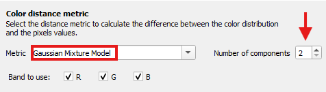

Selecting this metric will enable the option :guilabel:`Number of Components`, which allows you to specify the number of Gaussian components to use (default is 2).
Increasing the number of components may improve the approximation of complex color distributions, but it will also increase computation time.

.. warning::

    Using the :guilabel:`Gaussian Mixture Model` metric significantly increases computation time.
    The same applies when increasing the number of components.

GMM is a more computationally demanding metric than :ref:`Mahalanobis distance <calculate-distance-mahalanobis>`.
It is best suited for complex or multi-modal color distributions.
We recommend starting with the Mahalanobis method. If the results are not satisfactory, then try the GMM option.

You can restrict the computation to specific color bands by modifying the checkboxes in the :guilabel:`Band to Use` setting.
In this case, the GMM distance will be calculated using only the selected bands.
To learn how to adjust these settings, see: :ref:`Select Color Bands <bands_to_use>`.

.. _bands_to_use:

Select Color Bands
~~~~~~~~~~~~~~~~~~~~~~~~~~~~~~~~~~~~~~~~~~~~~~~~~~~~~~~~~~~~~~~~~~

It is possible to perform color distance calculations based **only on specific color bands**.
Bands that are not selected are excluded from the statistical distribution, meaning that their information does not influence the final result in any way.

In the :guilabel:`Band to Use` section, the **checkboxes** for the red (R), green (G), and blue (B) bands are selected by default, as shown in the image below.
Unchecking a band excludes it from the calculation.

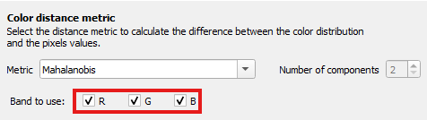

This feature allows you to tailor the color distance computation to your specific application.
For example, exclude the blue channel for better contrast in vegetation analysis or focus only on the red channel to highlight areas with high reflectance in thermal imaging.

Multi-Tiles Processing
---------------------------------------------------

By default, the plugin improves performance by dividing the input raster layer into **multiple tiles**, which are processed in parallel using multithreading.
This means that the color distance calculation is distributed across several **threads**, with each thread handling a different tile of the image at the same time.
This parallel execution significantly reduces processing time, especially for large orthomosaics.

For in-depth information on multithreaded execution, refer to the :ref:`Reference Manual on Background Task Execution <concurrent-future>`.

This behavior is enabled when the :guilabel:`Tiles processing` checkbox is selected, as shown in the image below.
If disabled, the raster layer is processed as a **single tile**, which means the entire image is analyzed sequentially pixel by pixel.
This single-tile approach can be useful for small orthomosaic.

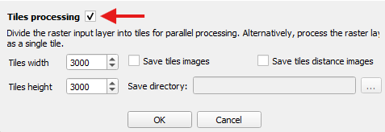

When multi-tile processing is active, you can configure the **tile size** to control how the raster is split.
Additionally, you can choose to **save intermediate results** for each tile, such as the original cropped image and the corresponding color distance image.
These output options are only available when tile-based processing is enabled.

.. |arrows-icon| raw:: html

    

Select the Tile Dimensions
~~~~~~~~~~~~~~~~~~~~~~~~~~~~~~~~~~~~~~~~~~~~~~~~~~~~~~~~~~~~~~~~~~

You can customize the **width** and **height** of the tiles into which the input raster layer is divided.
These dimensions determine how the raster is split and directly impact the **number of tiles** generated, which in turn can affect the **total computation time**.

To adjust the tile size, use the |arrows-icon| in the :guilabel:`Tiles width` and :guilabel:`Tiles height` fields, or enter the desired values manually in the corresponding text boxes.
The default tile size is **300 × 300 pixels**.

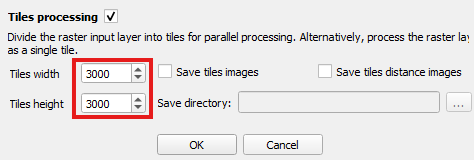

.. _save-tiles-images:

Save Tile Images
~~~~~~~~~~~~~~~~~~~~~~~~~~~~~~~~~~~~~~~~~~~~~~~~~~~~~~~~~~~~~~~~~~

As an additional output, the plugin allows you to save the **cropped sections of the input raster layer** (tiles) along with their corresponding **color distance images**.

Each crop is generated by dividing the input orthomosaic into tiles, based on the selected tile dimensions.
The **distance image** for each tile represents the result of the color distance calculation performed by the processing thread assigned to that tile.

Since saving these images introduces a small increase in computation time, this feature is **disabled by default**.
To enable it, check the following options:

- :guilabel:`Save tile images` — to save the cropped sections of the orthomosaic.
- :guilabel:`Save tile distance images` — to save the corresponding distance results.

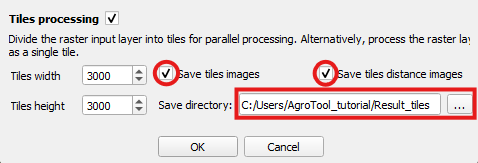

Once one or both options are enabled, the plugin requires a directory path where the images will be saved.
Specify this by clicking the |three-dot-icon| button next to :guilabel:`Save directory`.

The tile image output should look like this:

.. raw:: html

    

        

            

                
                
<code>Reference Image</code>

            

        

        

            

                
                
<code>Distance Image</code>

            

        

    

Start and Cancel Processing
---------------------------

.. |ok-icon| raw:: html

    

.. |cancel-icon| raw:: html

    

Once you have configured all plugin parameters, start the process by clicking the |ok-icon| button.

If there is an issue with the input configureation, an error message will appear. Refer to the relevant sections of this documentation to resolve the specific error described.

If everything is correct, the plugin will begin execution. A progress bar like the one shown below will indicate the current status of the operation:

.. figure:: _static/how_to/ProgressBar.png
   :align: center

You can **cancel the operation at any time** during processing by clicking the |cancel-icon| button in the progress bar window. The plugin will take a moment to stop execution and attempt to clean up intermediate data.

.. warning::

   If the process is canceled, no output raster will be generated. However, if tile image saving options were enabled (see :ref:`Save Tile Images <save-tiles-images>`), some tile images may have already been written to disk. In that case, these files must be deleted manually.
