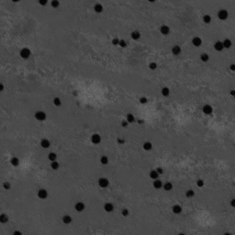
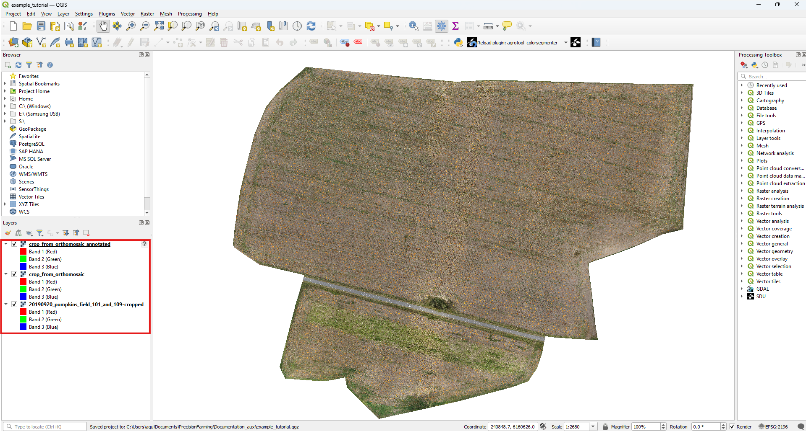
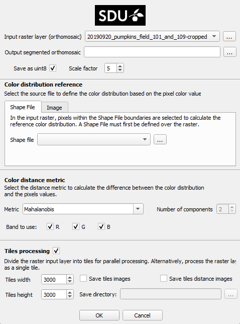
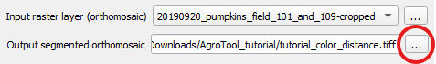
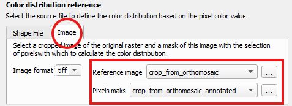
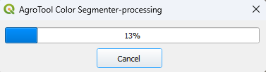

.. _tutorial:

Tutorial
============================================

This tutorial will walk you on how to use the **QGIS AgrooTool Color Segmenter** with a real example.

If *QGIS AgrooTool Color Segmenter* is not already installed, see :doc:`installation </installation>`.

We will processed an orthomosaic to segment pumpkins in a crop field.  At the end of this tutorial, you may expect your result orthomosaic to look like this:

The example dataset can be downloaded from Zenodo on this link: https://zenodo.org/record/8254412.

Save the dataset in a easy to reach location, for example ``/home/Documents/AgroTool_tutorial``. The dataset contains the following files:

* an orthomosaic from a pumpkin field with orange pumpkins on a brown/green field ``20190920_pumpkins_field_101_and_109-cropped.tif``.
* a crop of the orthomosaic ``crop_from_orthomosaic.tif``.
* an annotated copy of the cropped orthomosaic ``crop_from_orthomosaic_annotated.tif``.

.. raw:: html

    

        

            

                
                
<code>crop_from_orthomosaic.tif</code>

            

        

        

            

                
                
<code>crop_from_orthomosaic_annotated</code>

            

        

    

You can notice that ``crop_from_orthomosaic.tif`` and ``crop_from_orthomosaic_annotated.tif`` are identical images, execept for the annotations (red blobs) on some of the pumpkins.
In future uses of the plugin, make sure that this two images are identical — :ref:`here you can find out why <calculate-color-distribution-image>`.

Below we will provide step-by-step instructions on how to use SDU Agro Tools:

1. Open a blank project QGIS and save it under the name ``example_tutorial.qgz``, save it in a easy to reach location, for example ``/home/Documents/AgroTool_tutorial``.

2. Drag the files ``20190920_pumpkins_field_101_and_109-cropped.tif``, ``crop_from_orthomosaic.tif`` and ``crop_from_orthomosaic_annotated.tif`` from your folder into the :guilabel:`Layer` menu. Alternatively, check the official QGIS tutorial `Loading Data into the Map <https://docs.qgis.org/3.40/en/docs/training_manual/complete_analysis/analysis_exercise.html?utm_source=chatgpt.com#loading-data-into-the-map>`_.

.. |plugin-icon| raw:: html

    

3. Open the **AgrooToool Color Segmenter** plugin. You can do this by clicking on the plugin icon |plugin-icon| in the upper toolbox or by accessing the menu with the same logo within the :guilabel:`Processing Toolbox` on the right.

.. raw:: html

    

        

            

                
                
<code>ToolBar button</code>

            

        

        

            

                
                
<code>Processing ToolBar menu</code>

            

        

    

4. The *AgrooToool Color Segmenter* menu will pop up. This contains multiple configuration parameters to access the different options of the plugin (see :ref:`How-to Guide <how-to>`), while other options are selected by default.

5. Open the :guilabel:`Input raster layer (orthomosaic)` drop-down menu and make sure to select the file ``20190920_pumpkins_field_101_and_109-cropped.tif`` corresponding to our input raster layer.

6. Now click on the three-dot button next to the :guilabel:`Output segmented orthomosaic` text bar. This will open a window where you can select where to save the segmented orthomosaic plugin result.
   For this tutorial, we'll save the result to ``/home/Documents/AgroTool_tutorial`` and name it as ``tutorial_color_distance``.

7. The default configuration expect to work with *shape files*, you can explore this option :ref:`here <calculate-color-distribution-shape>`.
   For our tutorial, we will use the :ref:`calculation based on images <calculate-color-distribution-image>`. First, select the :guilabel:`Image` tab, which will open the image menu.
   As you can see, the default image format is ``.tiff`` but its possible to :ref:`use .jpg images <calculate-color-distribution-image>`.
   Open the :guilabel:`Reference image` drop-down menu and select the file ``crop_from_orthomosaic.tif``, in the :guilabel:`Pixel mask` menu select ``crop_from_orthomosaic_annotated.tif``.

.. |ok-icon| raw:: html

    

.. |cancel-icon| raw:: html

    

8. At this point everything is ready! Simply press the |ok-icon| button to begin the processing. You'll see a window with a progress bar. You can click |cancel-icon| at any time to stop the operation.

9. Once the processing is complete, you'll see that the resulting orthomosaic ``tutorial_color_distance.tif`` has been automatically added to the current project.
It is an orthomosaic with the same appearance as the entrance but in grayscale where all the pumpkins appear **segmented in black**.
Contretly all the pixels within the reference color distribution are segmented, you can explore this operation in our :ref:`Background section <background>`.
You can also find the result at ``/home/Documents/AgroTool_tutorial/tutorial_color_distance``.

.. figure:: _static/tutorial/Result.png

Congratulations, you have segmented your first orthomosaic with **AgroTool Color Segmeneter!**

This tutorial serves as a first approach to the tool, but there are many more options to explore.
We've just created a color segmentation based on the :ref:`Mahalanobis distance <mahalanobis_distance>`, but we can also do so using :ref:`Gaussian mixture models distance metrics <calculate-distance-gmm>`.

Additionally we can compute the color distribution using a :ref:`shape file <calculate-color-distribution-shape>` instead of images; change the :ref:`tiles dimension <change-tiles-dimension>` involved in the :ref:`multi-tiles simultaneous processing <multi-tiles-processing>`, and :ref:`save tiles image <save-tiles-images>` as a dfferent result.

There are many other options. Feel free to explore our documentation in depth!
