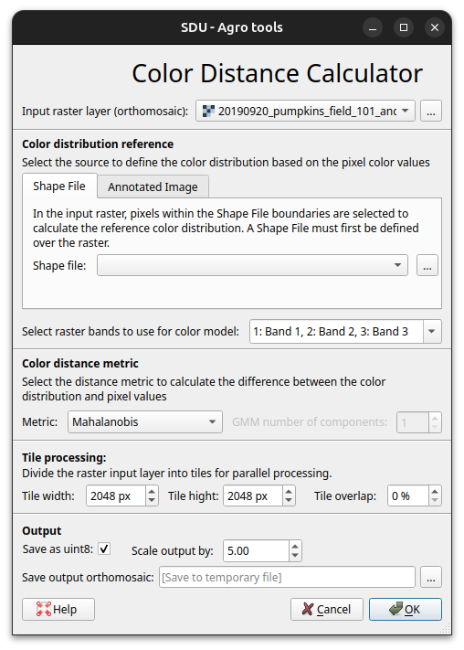
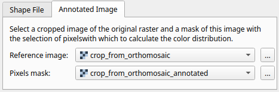
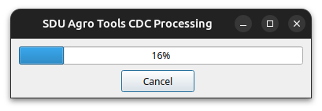
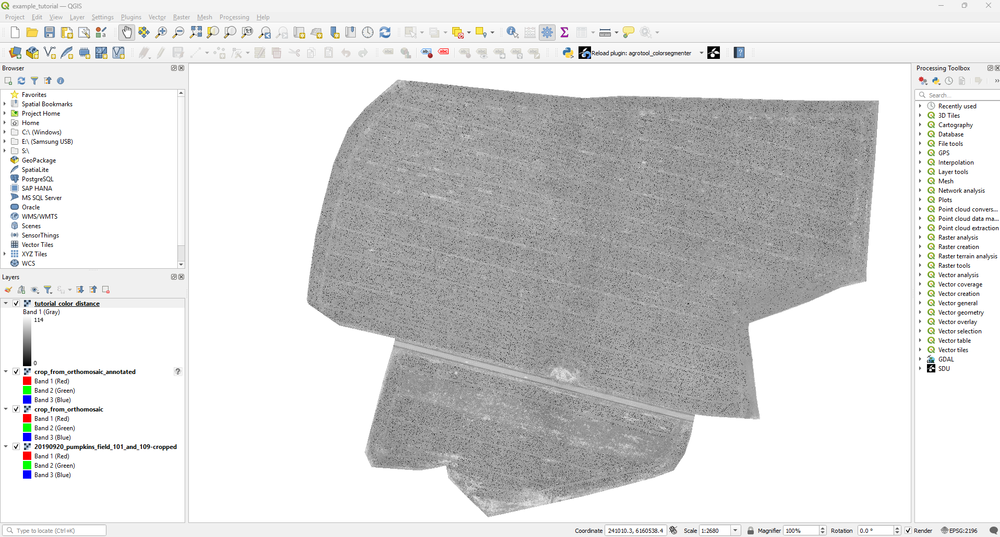

CDC - Color Distance Calculator
===============================

This tutorial will walk you on how to use the color distance calculator with a real example.

If *SDU Agro Tools* is not already installed, see :doc:`../installation`.

We will processed an orthomosaic to segment pumpkins in a crop field.  At the end of this tutorial, you may expect your result orthomosaic to look like this:

.. figure:: ../_static/example_pumpkins/color_distance_crop.png

The example dataset can be downloaded from Zenodo on this link: https://zenodo.org/record/8254412.

Save the dataset in a easy to reach location. The dataset contains the following files:

* an orthomosaic from a pumpkin field with orange pumpkins on a brown/green field ``20190920_pumpkins_field_101_and_109-cropped.tif``.
* a crop of the orthomosaic ``crop_from_orthomosaic.tif``.
* an annotated copy of the cropped orthomosaic ``crop_from_orthomosaic_annotated.tif``.

.. raw:: html

    

        

            

                
                
<code>crop_from_orthomosaic.tif</code>

            

        

        

            

                
                
<code>crop_from_orthomosaic_annotated.tif</code>

            

        

    

You can notice that ``crop_from_orthomosaic.tif`` and ``crop_from_orthomosaic_annotated.tif`` are identical images, except for the annotations (red blobs) on some of the pumpkins. To make your own dataset see :doc:`./cdc-dataset`.

Below we will provide step-by-step instructions on how to use SDU Agro Tools:

1. Open a blank project QGIS and save it under the name ``example_tutorial.qgz``, save it in a easy to reach location.

2. Drag the files ``20190920_pumpkins_field_101_and_109-cropped.tif``, ``crop_from_orthomosaic.tif`` and ``crop_from_orthomosaic_annotated.tif`` from your folder into the :guilabel:`Layer` menu. Alternatively, check the official QGIS tutorial `Loading Data into the Map <https://docs.qgis.org/3.40/en/docs/training_manual/complete_analysis/analysis_exercise.html?utm_source=chatgpt.com#loading-data-into-the-map>`_.

.. figure:: ../_static/tutorial/cdc/Step1.png

.. |plugin-icon-cdc| raw:: html

    

3. Open the **SDU Agro Tools** plugin. You can do this by clicking on the plugin toolbar menu |plugin-icon-cdc| in the upper toolbox or by accessing the menu with the same logo within the :guilabel:`Processing Toolbox` on the right. In this guide we will use the toobar menu. The processing menu have the same options but with a different graphical interface.

.. raw:: html

    

        

            

                
                
<code>ToolBar button</code>

            

        

        

            

                
                
<code>Processing ToolBar menu</code>

            

        

    

4. The *Color Distance Calculator* menu will pop up. This contains multiple configuration parameters to access the different options of the plugin (see :doc:`../explanations/cdc-ref`), while other options are selected by default.

5. Open the :guilabel:`Input raster layer (orthomosaic)` drop-down menu and make sure to select the file ``20190920_pumpkins_field_101_and_109-cropped.tif`` corresponding to our input raster layer.

6. The default configuration expect to work with *shape files*, See :ref:`how to make a CDC dataset from vector layer <cdc-dataset-from-vector-layer>` for more information. For this tutorial, we will use the :ref:`calculation based on reference image <cdc-dataset-from-reference-image>`. First, select the :guilabel:`Annotated Image` tab, which will open the image menu. Open the :guilabel:`Reference image` drop-down menu and select the file ``crop_from_orthomosaic.tif``, in the :guilabel:`Pixel mask` menu select ``crop_from_orthomosaic_annotated.tif``.

7. Now click on the three-dot button next to the :guilabel:`Save output orthomosaic` text bar. This will open a window where you can select where to save the segmented orthomosaic plugin result. If no output file is chosen the output will be saved in a temporary file and discarded when QGIS is closed. For this tutorial, we'll save the result as ``tutorial_color_distance.tif``.

.. |ok-icon| raw:: html

    

.. |cancel-icon| raw:: html

    

8. At this point everything is ready! Simply press the |ok-icon| button to begin the processing. You'll see a window with a progress bar. You can click |cancel-icon| at any time to stop the operation.

9. Once the processing is complete, you'll see that the resulting orthomosaic ``tutorial_color_distance.tif`` has been automatically added to the current project.
It is an orthomosaic with the same appearance as the entrance but in grayscale where all the pumpkins appear **in black**.

Congratulations, you now have a orthomosaic with color distance.

This tutorial serves as a first approach to the tool, but there are many more options to explore.
We've just created a color segmentation based on the :ref:`Mahalanobis distance <cdc-mahalanobis-distance>`, but we can also do so using :ref:`Gaussian mixture models distance metrics <cdc-gmm-distance>`.

Additionally we can change the :ref:`cdc-tile-size` involved in the :ref:`cdc-tile-processing`.

There are many other options. Feel free to explore our documentation in depth!
