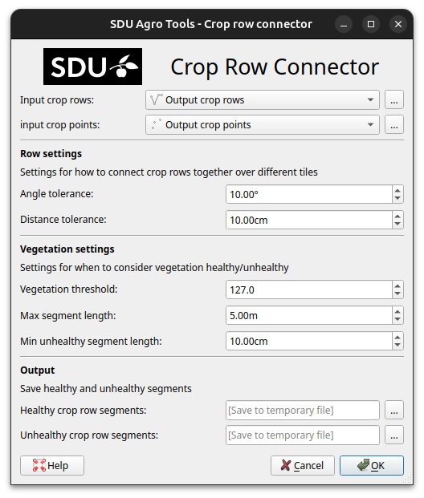

Crop Row Connector Tutorial
===========================

This tutorial will walk you though how to use the **crop row connector** with a real example.

If *SDU Agro Tools* is not already installed, see :doc:`../installation`.

We will processed an orthomosaic of a grass field to find the individual crop rows and detect gaps in the rows. At the end of this tutorial, you may expect your results to look like this:

.. figure:: ../_static/tutorial/crop-row-connector/result.png

The example dataset can be downloaded from Zenodo on this link: https://zenodo.org/TODO.

Save the dataset in a easy to reach location. The dataset contains the following files:

* an orthomosaic from a grass field ``20190920_pumpkins_field_101_and_109-cropped.tif``.
* a crop of the orthomosaic ``crop_from_orthomosaic.tif``.
* an annotated copy of the cropped orthomosaic ``crop_from_orthomosaic_annotated.tif``.

TODO update file names.

Get crop rows
-------------

First we need to calculate the color distance, which can be done by following this CDC (Color Distance Calculator) guide: :doc:`./cdc`.

With that we can get the crop rows by following this crop row detector guide: :doc:`./crop-row-detector`.

In this guide we will assume the output of **crop row detector** is open i QGIS as a temporary layers with the names ``Output crop rows`` and ``Output crop points``.

Determine Vegetation Threshold
------------------------------

Crop Row Connector will split the rows based on if the vegetation is healthy or unhealthy. To determine a good vegetation threshold we can filter the crop points and compare with the orthomosaic to see where crops are missing etc.

To Filter the crop points:

    ``Right click on the Output crop points layer``

    ``Select filter``

    ``In the Query Builder enter the following query:``

    ``"vegetation" > 50``

    ``Click OK``

Zoom in on the crop points with the orthomosaic as background and see if the points left after the filter matches where the crops are and are gone where the crops are missing. You can change the value of 50 if something higher if there are points where the crops are missing er lower if there is crops with out points. In this tutorial we will continue with a vegetation threshold value of 50.

Run Crop Row Connector
----------------------

As the input we select the **Output crop rows** and **Output crop points** in :guilabel:`Input crop rows` and :guilabel:`Input crop points` respectably.

In row settings we will keep the default values. In vegetation settings we change the :guilabel:`Vegetation threshold` value to 50 and keep the other settings as default.

In the output if desired :guilabel:`Healthy crop row segments` and :guilabel:`Unhealthy crop row segments` can be set to files or leaved as default temporary layers in memory.

Clicking ``OK`` will run crop row connector. This will take some time but pulsing progress will appear to indicate it is working.

When done two new vector layers are added to QGIS. One with the healthy crop rows and one with the unhealthy crop rows.
