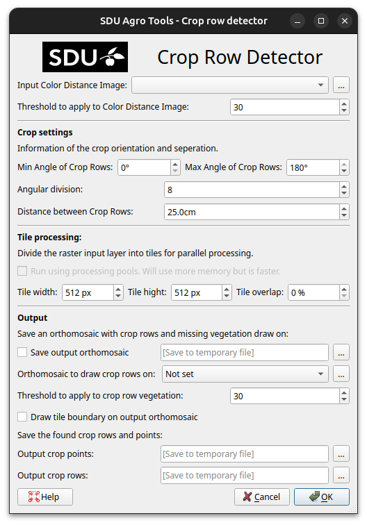

Crop Row Detector Tutorial
==========================

This tutorial will walk you though how to use the **crop row detector** with a real example.

If *SDU Agro Tools* is not already installed, see :doc:`../installation`.

We will processed an orthomosaic of a grass field to find the individual crop rows and detect gaps in the rows. At the end of this tutorial, you may expect your results to look like this:

.. figure:: ../_static/tutorial/crop-row-detector/result.png

The example dataset can be downloaded from Zenodo on this link: https://zenodo.org/TODO.

Save the dataset in a easy to reach location. The dataset contains the following files:

* an orthomosaic from a grass field ``20190920_pumpkins_field_101_and_109-cropped.tif``.
* a crop of the orthomosaic ``crop_from_orthomosaic.tif``.
* an annotated copy of the cropped orthomosaic ``crop_from_orthomosaic_annotated.tif``.

TODO update file names.

Get Color Distance
------------------

First we need to calculate the color distance, which can be done by following this CDC (Color Distance Calculator) guide: :doc:`./cdc`.

In this guide we will assume the output of CDC is open i QGIS as a temporary layer with the name ``CDC Output``.

Determine Threshold
-------------------

Crop Row Detector needs to apply a threshold to the color distance in order to segment the crop rows from background.

First we will look at the histogram og the color distance orthomosaic:

    ``Double click the color_distance layer``

    ``Select the Histogram page``

    ``Click Compute histogram``

    ``It can be useful to only show band 1. Click Prefs/Actions - check Show selected band``

The crop rows will have the smallest color distance and we see a peak around 10 but to be sure most of the crops are within the threshold, a threshold of 30 seems better without including too much of the tail.

We can test this threshold by creating a new layer with the threshold applied:

    ``In the Raster menu select Raster Calculator``

    ``In Raster Calculator Expression input "color_distance@1" < 30``

    ``Check the Create on-the-fly raster instead of writing layer to disk``

    ``Click OK``

This will create a raster with white as the crop rows and black as the background.

By comparing this to the original orthomosaic we can see that most of the crops are white and the background is black the a threshold of 30 seems good and we will use this to run crop row detector.

Run Crop Row Detector
---------------------

As the input we select the **CDC Output** and set the threshold to 30. The crop settings we leave as is since we want all crop angles and the crop distance between rows is 25cm. Tile processing settings we will keep the default.

In the output we will skip drawing the rows on an orthomosaic. If desired :guilabel:`Output crop points` and :guilabel:`Output crop rows` can be set to files or leaved as default temporary layers in memory.

Clicking ``OK`` will run crop row detector. This will take some time but a progress bar will appear.

When done two new vector layers are added to QGIS. One with the crop rows and one with crop points in the crop rows.
